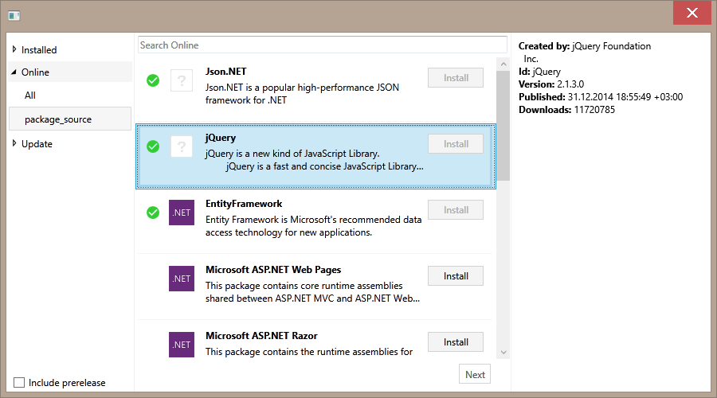
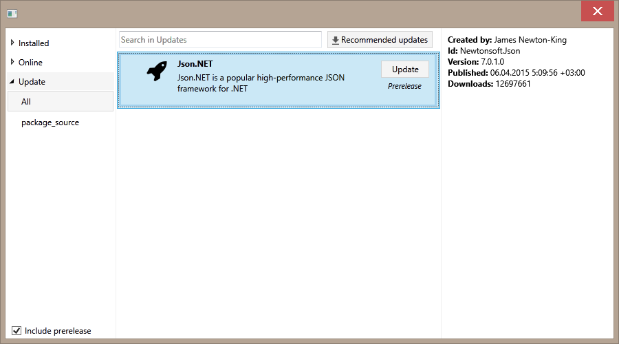
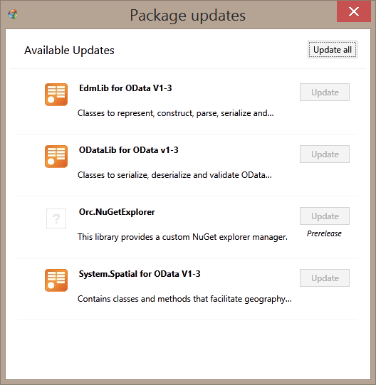

Orc.NuGetExplorer
==================

[](https://gitter.im/WildGums/Orc.NuGetExplorer?utm_source=badge&utm_medium=badge&utm_campaign=pr-badge&utm_content=badge)


This library provides everything you need to explore and download packages from the NuGet gallery as well as any private feed.

It can be used as part of a plugin system for your application.

Features
---------

- WPF user interface
- Explore packages that are:
    - Already installed
    - Available online
    - Ready to be updated
- Support package sources, which requires authentication
- Smart update (Recommends updates for your plugins)
- Verification of package source
- Ability to work in the background

NuGet Packages
---------------

library consists of two NuGet packages:

-  **[Orc.NuGetExplorer](http://www.nuget.org/packages/Orc.NuGetExplorer/)** => Core logic, which can be used to work in the background.
-  **[Orc.NuGetExplorer.Xaml](http://www.nuget.org/packages/Orc.NuGetExplorer.Xaml)** => Provides the UI for  *Orc.NuGetExplorer*

Screenshots
------------

Packages available: 



Available updates:



Recommended updates:



How to use
------------

NuGetExplorer is made up of several services:

- **INuGetConfigurationService** => Configure NuGetExplorer
- **INuGetFeedVerificationService** => Verify the package source feed
- **IPackageBatchService** => Show a window with a list of package to take action on
- **IPackageOperationService** => Execute an operation with the package (Install, Uninstall or Update)
- **IPackageQueryService** => Can be used to search packages in the background
- **IPackagesUIService** => Show the NuGetExplorer window
- **IPackagesUpdatesSearcherService** => Used for searching updates with the options of release/prerelease/recommended
- **IRepositoryService** => Used to get access to specific repositories. Can be used in conjunction with *IPackageQueryService*

Watcher:

- **PackageManagerWatcherBase** => Abstract class, which is used to create a watcher for package management operations


Examples
---------

Usage of *IPackagesUIService* for showing NuGetExplorer dialog box

```C#
public class NuGetManager
{
    private readonly IPackagesUIService _packagesUiService;
    
    public NuGetManager(IPackagesUIService packagesUiService)
    {
        Argument.IsNotNull(() => packagesUiService);
        
        _packagesUiService = packagesUiService;
    }
    
    private async Task ShowNuGetDialog()
    {
	    await _packagesUiService.ShowPackagesExplorer();
    }
}
```
Use *IPackageBatchService* and *IPackagesUpdatesSearcherService* for checking for updates

```C#
public class SmartUpdater
{
    private readonly IPackagesUpdatesSearcherService _packagesUpdatesSearcherService;
    private readonly IPackageBatchService _packageBatchService;
    
    public SmartUpdater(IPackageBatchService packageBatchService, IPackagesUpdatesSearcherService packagesUpdatesSearcherService)
    {
        Argument.IsNotNull(() => packageBatchService);
        Argument.IsNotNull(() => packagesUpdatesSearcherService);
        
        _packageBatchService = packageBatchService;
        _packagesUpdatesSearcherService = packagesUpdatesSearcherService;
    }
    
    private async Task ShowRecommenedUpdates()
    {
        var packages = await _packagesUpdatesSearcherService.SearchForUpdatesAsync(false);
	    await _packageBatchService.ShowPackagesBatchAsync(packages, PackageOperationType.Update);
    }
}
```
 
